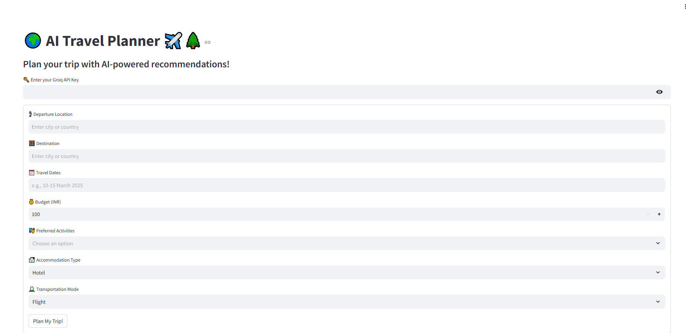

readme_content = """
# AI Travel Planner

This project is an **AI-powered travel planner** web application built using **Streamlit** and **Autogen**. The app helps users plan their trips by generating personalized travel itineraries based on user input like departure location, destination, travel dates, budget, preferred activities, accommodation type, and transportation mode.

## Demo

**Live Demo**: [Click here to try the app](https://huggingface.co/spaces/vishnukg/travelApp)

Here is a screenshot showing the app's result in action:


## 


## Features

- **User Input Form**: Collects details like departure location, destination, travel dates, budget, preferred activities, accommodation type, and transportation mode.
- **Personalized Itinerary**: Generates an optimized travel itinerary based on user input, including transport and accommodation suggestions.
- **Real-time Recommendations**: Provides AI-generated suggestions on the best options for transport, accommodation, and activities based on the user’s preferences and budget.

## Requirements

- Python 3.10
- Streamlit
- Autogen
- Python-dotenv
- Additional libraries in `requirements.txt`

## Installation Guide

Follow the steps below to set up the project locally:

### 1. Clone the Repository

```bash
git clone https://github.com/vishnu-kg/AgenticAI_TravelPlanner.git

python3 -m venv venv
venv\Scripts\activate  # for Windows

pip install -r requirements.txt


streamlit run main.py

